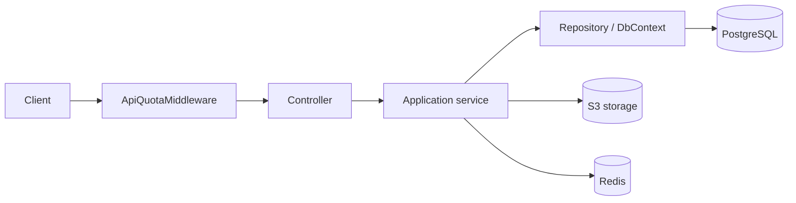

# Stash

A Google Drive-style file storage backend: folders, file upload/download, sharing, and Stripe billing with quotas.

[](https://dotnet.microsoft.com/)
[](https://www.postgresql.org/)
[](https://redis.io/)

## Overview

Stash is a backend API for cloud file storage. Users register with email verification, organize files in folders, share items with other users, and are billed through Stripe subscription plans that enforce storage and API-request quotas. It is built with Clean Architecture in C# / ASP.NET Core and runs on PostgreSQL, Redis, and S3-compatible object storage.

## Features

- JWT authentication: register, login, refresh tokens, logout, forgot/reset password
- Email verification required before login (SMTP, HTML templates, Redis-backed tokens)
- Folders: create, rename, move, soft-delete/trash, restore, permanent delete
- Files: multipart upload (10 GB limit), download, rename, move, trash/restore/permanent delete
- Sharing: share files/folders with users, view/edit permissions, expiry, revoke, access check
- Stripe billing: subscription plans, checkout sessions, cancel, webhooks
- Quotas: per-plan storage limits, monthly API-request limits, max file size (middleware-enforced, 429 on exceed)
- Usage tracking: storage, bandwidth, and request counters per billing period
- OpenAPI + Scalar API reference in Development

## Tech Stack

| Layer | Technology |
|---|---|
| Framework | ASP.NET Core 10 (`net10.0`), nullable + implicit usings |
| ORM / Migrations | Entity Framework Core 10 (Npgsql provider) |
| Database | PostgreSQL 16 |
| Cache / Tokens | Redis 7 (`StackExchange.Redis`) |
| Object storage | S3-compatible via `AWSSDK.S3` (SeaweedFS in dev) |
| Auth | JWT Bearer, ASP.NET Core Identity password hasher |
| Email | SMTP (`System.Net.Mail`), local Mailpit in dev |
| Payments | Stripe.net 52 |
| API docs | `Microsoft.AspNetCore.OpenApi` + Scalar |

## Architecture

Four projects, dependencies point inward (`Api -> Infrastructure -> Application -> Core`):

| Project | Responsibility |
|---|---|
| `Drive.Core` | Entities (`User`, `File`, `Folder`, `ItemShare`, `Plan`, `Subscription`, `Usage`, `RefreshToken`), enums, `Result`/`Error` model |
| `Drive.Application` | Service interfaces, DTOs, business logic (auth, files, folders, sharing, billing, quotas) |
| `Drive.Infrastructure` | EF Core `DbContext`/repositories/migrations, Redis cache, S3 storage, SMTP email, Stripe, Identity |
| `Drive.Api` | Controllers, contracts, `ApiQuotaMiddleware`, `GlobalExceptionHandler`, DI wiring |



## Getting Started

### Prerequisites

- [.NET SDK 10](https://dotnet.microsoft.com/download) (`net10.0`, tested with SDK 10.0.400)
- Docker (Desktop on macOS works; images used: `postgres:16-alpine`, `redis:7-alpine`, `chrislusf/seaweedfs:latest`, `axllent/mailpit:latest`)
- (Optional, for bucket setup) AWS CLI

### 1. Clone

```bash
git clone https://github.com/abd0helmy/stash
cd stash
```

### 2. Configure `Docker/.env` (placeholder values — never commit real secrets)

```bash
POSTGRES_USER=<your-postgres-user>
POSTGRES_PASSWORD=<your-postgres-password>
POSTGRES_DB=drive_db
S3_ACCESS_KEY=<your-s3-access-key>
S3_SECRET_KEY=<your-s3-secret-key>
S3_BUCKET=drive
```

> The database name must match `Database=` in your connection string (see Troubleshooting).

### 3. Start infrastructure

```bash
docker compose -f Docker/docker-compose.yml --env-file Docker/.env up -d
```

| Service | Port |
|---|---|
| PostgreSQL | `5432` |
| Redis | `6379` |
| SeaweedFS S3 API | `8333` |
| SeaweedFS filer / master | `8888` / `9333` |
| Mailpit SMTP | `1025` |
| Mailpit UI | `8025` |

### 4. Create the S3 bucket

```bash
aws s3 mb s3://drive --endpoint-url http://localhost:8333
```

### 5. Configure secrets (Development only)

```bash
cd Drive.Api
dotnet user-secrets init
dotnet user-secrets set "ConnectionStrings:DefaultConnection" "Host=localhost;Port=5432;Database=drive_db;Username=<your-postgres-user>;Password=<your-postgres-password>"
dotnet user-secrets set "S3:AccessKey" "<your-s3-access-key>"
dotnet user-secrets set "S3:SecretKey" "<your-s3-secret-key>"
dotnet user-secrets set "JwtOptions:SecretKey" "$(openssl rand -base64 48)"
dotnet user-secrets set "Stripe:SecretKey" "<your-stripe-secret-key>"
dotnet user-secrets set "Stripe:PublishableKey" "<your-stripe-publishable-key>"
dotnet user-secrets set "Stripe:WebhookSecret" "<your-stripe-webhook-secret>"
```

> Email needs no secrets in Development: it points to the local Mailpit (`localhost:1025`, no auth) out of the box. Open <http://localhost:8025> to read verification/reset emails.

### 6. Apply migrations

Migrations run automatically on startup **in Development**. For other environments:

```bash
dotnet ef database update --project ../Drive.Infrastructure --startup-project .
```

### 7. Run

```bash
dotnet run --project Drive.Api --profile http
```

API docs: Scalar UI at <http://localhost:5003/scalar>, OpenAPI JSON at <http://localhost:5003/openapi/v1.json>.

## API Overview

Auth: `Bearer <accessToken>` from `POST /api/Auth/login`. `Plans` and `Auth`/`Webhooks` are public; everything else requires a token.

| Method | Route | Auth | Description |
|---|---|---|---|
| POST | `/api/Auth/register` | No | Register (verification email sent) |
| POST | `/api/Auth/login` | No | Login, requires verified email |
| POST | `/api/Auth/refresh-token` | No | Rotate tokens |
| POST | `/api/Auth/logout` | Yes | Revoke refresh token |
| POST | `/api/Auth/verify-email` | No | Verify email with token |
| POST | `/api/Auth/resend-verification-email` | No | Resend verification email |
| POST | `/api/Auth/forgot-password` | No | Request password reset |
| POST | `/api/Auth/reset-password` | No | Reset password with token |
| GET | `/api/Users/me` | Yes | Current profile |
| PATCH | `/api/Users/password` | Yes | Change password |
| POST | `/api/Files/upload` | Yes | Multipart upload (`file` + optional `folderId`) |
| GET | `/api/Files?folderId=` | Yes | List files (root when omitted) |
| GET | `/api/Files/trash` | Yes | Trashed files |
| GET | `/api/Files/{id}` | Yes | File metadata |
| GET | `/api/Files/{id}/download` | Yes | File content |
| PATCH | `/api/Files/{id}/rename`, `/move` | Yes | Rename / move |
| DELETE | `/api/Files/{id}`, `/{id}/forever` | Yes | Trash / delete permanently |
| POST | `/api/Files/{id}/restore` | Yes | Restore from trash |
| POST/GET/PATCH/DELETE | `/api/Folders...` | Yes | Same lifecycle as files (`?parentFolderId=`) |
| POST | `/api/Shares` | Yes | Share file/folder with a user |
| GET | `/api/Shares/shared-with-me` | Yes | Items shared with me |
| PATCH/DELETE | `/api/Shares/{id}/...` | Yes | Change permission / revoke |
| GET | `/api/Shares/access-check` | Yes | Check access to an item |
| GET | `/api/Plans`, `/api/Plans/{id}` | No | List subscription plans |
| GET | `/api/Subscriptions/me` | Yes | Active subscription |
| POST | `/api/Subscriptions/checkout` | Yes | Stripe checkout session |
| POST | `/api/Subscriptions/cancel` | Yes | Cancel subscription |
| GET | `/api/Usage/me` | Yes | Current usage vs plan limits |
| POST | `/api/Webhooks/stripe` | No | Stripe webhook (signature-verified) |

```bash
# Login
curl -s -X POST http://localhost:5003/api/Auth/login \
  -H 'Content-Type: application/json' \
  -d '{"email":"<you@example.com>","password":"<your-password>"}'

# Upload (multipart/form-data, folderId optional)
curl -s -X POST http://localhost:5003/api/Files/upload \
  -H "Authorization: Bearer <TOKEN>" \
  -F "file=@/path/to/report.pdf" \
  -F "folderId=<optional-folder-guid>"
```

## Configuration

| Key | Purpose | Default / Example |
|---|---|---|
| `ConnectionStrings:DefaultConnection` | PostgreSQL connection | `Host=localhost;Port=5432;Database=drive_db;...` |
| `ConnectionStrings:Redis` (or `Redis:ConnectionString`) | Redis endpoint | `localhost:6379` |
| `S3:ServiceUrl` | S3-compatible endpoint | `http://localhost:8333` |
| `S3:AccessKey` / `S3:SecretKey` | S3 credentials | placeholders |
| `S3:BucketName` | Bucket for file objects | `drive` |
| `Email:Host` / `Email:Port` | SMTP server | `localhost` / `1025` (local Mailpit in dev) |
| `Email:SenderEmail` / `Email:SenderName` | From address | `noreply@drive.com` / `Drive` |
| `Email:Username` / `Email:Password` | SMTP credentials | empty in dev (Mailpit needs no auth) |
| `Email:EnableSsl` | STARTTLS | `false` in dev (Mailpit), `true` for real providers |
| `Email:ClientAppUrl` | Frontend links in emails | `http://localhost:5173` |
| `JwtOptions:SecretKey` | Token signing key (min 32 chars) | placeholder |
| `JwtOptions:Issuer` / `Audience` | Token validation | `DriveApi` / `DriveClient` |
| `JwtOptions:ExpirationInMinutes` | Access token lifetime | `60` |
| `Stripe:PublishableKey` / `SecretKey` | Stripe API keys | placeholders |
| `Stripe:WebhookSecret` | Webhook signature verification | placeholder |
| `Stripe:SuccessUrl` / `CancelUrl` | Checkout redirects | frontend `/billing/...` URLs |

## Billing and Quotas

Plans are seeded by migration (`Free` 5 GB / 10k req/mo / 100 MB files, `Pro` 100 GB / 100k req/mo / 2 GB files, `Business` 1 TB / 1M req/mo / 10 GB files). New users get a Free subscription automatically on first billing touch. `ApiQuotaMiddleware` runs before every authenticated `/api/*` call (except webhooks): it rejects over-limit requests with `429`, and increments the request counter after the response. Uploads reserve storage atomically and roll back on failure. Upgrades go through Stripe Checkout; renewals/cancellations arrive via `POST /api/Webhooks/stripe`.

## Project Structure

```text
Drive.Api/                 # Controllers, Contracts, Middleware, Program.cs, appsettings*.json
Drive.Application/         # Auth, Billing/{Plans,Subscriptions,Usage}, Files, Folders, Sharing + interfaces/DTOs
Drive.Core/                # Entities, Enums, Common (Result/Error)
Drive.Infrastructure/      # Billing/Stripe, Caching/Redis, Email, Identity, Persistence (EF), Repositories, Storage/S3
Docker/                    # docker-compose.yml (postgres, redis, seaweedfs), .env (gitignored)
Drive.sln                  # Solution (4 projects, no test projects)
```

## Troubleshooting

- **Port `5003` already in use:** a previous `Drive.Api` process is still holding it. Find it with `lsof -i :5003` and `kill -9 <PID>` before `dotnet run`.
- **S3 errors on upload/download:** the `drive` bucket must exist (step 4). Also confirm `S3:ServiceUrl/AccessKey/SecretKey` match the SeaweedFS container.
- **Database name mismatch:** `POSTGRES_DB` in `Docker/.env` must equal `Database=` in the connection string, otherwise migrations target a different database than the app reads.
- **Secrets ignored:** `dotnet user-secrets` only loads in the `Development` environment. Production needs real env vars or a secret store.
- **SMTP port on macOS:** dev email goes to the local Mailpit (`localhost:1025`, no SSL). For a real provider use port `587` (STARTTLS) — port `465` (implicit SSL) is not supported by `SmtpClient`.
- **`401` with empty body:** missing/expired Bearer token. Log in again and send `Authorization: Bearer <TOKEN>`.
- **Over-limit requests:** `429 Too Many Requests` with code `Billing.ApiRequestQuotaExceeded` means the monthly quota is exhausted.

## Contributing

Open an issue or pull request against `main`. Keep commits in conventional style (`feat:`, `fix:`, `chore:`, `docs:`) and do not commit secrets — use `dotnet user-secrets` for local development.

## License

MIT — see [LICENSE](./LICENSE).
